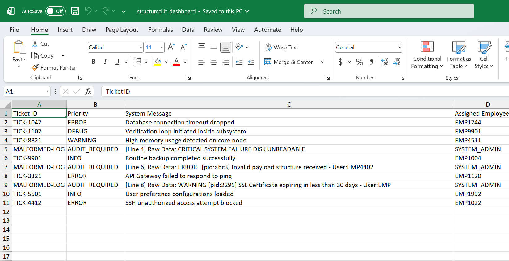
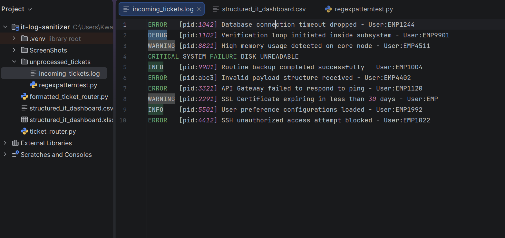
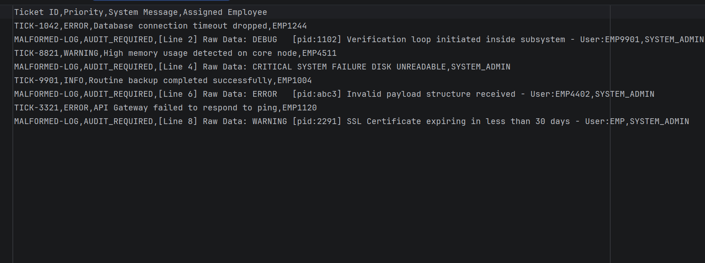

# 🚀 Python Log Processing Pipeline

> **Transforming raw IT ticket logs into structured CSV and Excel reports using Python, Regular Expressions, and OpenPyXL.**


---
<p align="center">
    
</p>

# 📖 Overview

IT systems generate large volumes of log data every day. While these logs contain valuable operational information, they are often stored as unstructured text, making them difficult to review, organize, and analyze manually.

This project automates the transformation of raw IT ticket logs into structured reports. Using Python and Regular Expressions, it extracts key information, validates log entries, identifies malformed records, and exports the results into both CSV and formatted Excel reports for easier analysis and reporting.

---

# ✨ Features

- 📂 Reads raw IT ticket log files
- 🔍 Parses log entries using Regular Expressions
- 📋 Extracts:
  - Ticket ID
  - Priority Level
  - System Message
  - Assigned Employee
- ⚠️ Detects malformed log entries
- 📝 Preserves malformed records for auditing
- 📄 Generates structured CSV reports
- 📊 Automatically creates formatted Excel reports
- 📏 Automatically adjusts Excel column widths
- 📈 Displays processing statistics

---

# 🛠 Technologies Used

- Python 3
- Regular Expressions (`re`)
- OpenPyXL
- CSV Module
- OS Module
- File Handling

---

# 📂 Project Structure

```text
python-log-processing-pipeline/
│
├── formatted_ticket_router.py
├── ticket_router.py
├── regexpatterntest.py
│
├── unprocessed_tickets/
│   └── incoming_tickets.log
│
├── structured_it_dashboard.csv
├── structured_it_dashboard.xlsx
│
├── ScreenShots/
│   ├── incominglog.png
│   ├── csv data.png
│   ├── csv_text.png
│   └── exceloutput.png
│
├── LICENSE
└── README.md
```

---

# ⚙️ How It Works

```text
Raw IT Ticket Logs
        │
        ▼
Directory Scanner
        │
        ▼
Regular Expression Parser
        │
 ┌───────────────┐
 │               │
 ▼               ▼
Valid Logs   Malformed Logs
 │               │
 └───────┬───────┘
         ▼
 Structured Dataset
         │
         ▼
 CSV Report
         │
         ▼
 Excel Dashboard
```

---

# 📄 Sample Input

The application processes raw IT ticket logs stored in the **incoming_tickets.log** file.

<p align="center">
    
</p>

---

# 📊 Output

After processing the log file, the application automatically generates two structured reports:

- **structured_it_dashboard.csv**
- **structured_it_dashboard.xlsx**

## 📄 CSV Output

The parsed ticket information is exported into a structured CSV file for reporting, analysis, or further processing.

### CSV Data Table & Raw CSV

<table align="center">
  <tr>
    <td align="center">
      <strong>CSV Data Table</strong><br><br>
      
    </td>
    <td align="center">
      <strong>Raw CSV File</strong><br><br>
      
    </td>
  </tr>
</table>
---

## 📊 Excel Dashboard

The same structured data is automatically exported into a formatted Excel workbook with adjusted column widths for improved readability.

<p align="center">
    
</p>

---

# 🔍 Malformed Log Handling

Rather than silently discarding malformed log entries, the application preserves them by assigning the status **AUDIT_REQUIRED**.

This allows users to identify records that require manual inspection while ensuring potentially important information is not lost during processing.

---
# 🧪 Development Notes

The repository includes a **regexpatterntest.py** script that was used during development to test and refine the Regular Expression patterns before integrating them into the main processing pipeline.

---

# 🚀 Getting Started

### Clone the repository

```bash
git clone https://github.com/kwd-larbi/python-log-processing-pipeline.git
```

### Navigate into the project

```bash
cd python-log-processing-pipeline
```

### Install dependencies

```bash
pip install openpyxl
```

### Run the application

```bash
python formatted_ticket_router.py
```

---

# 💡 Skills Demonstrated

This project demonstrates practical software engineering skills including:

- Python Programming
- Automation
- Regular Expressions (Regex)
- File Handling
- Directory Traversal
- Data Validation
- Data Parsing
- CSV Processing
- Excel Automation (OpenPyXL)
- Report Generation
- Problem Solving

---

# 📚 What I Learned

Building this project strengthened my understanding of:

- Parsing structured text using Regular Expressions
- Automating repetitive workflows with Python
- Reading and writing files
- Working with CSV datasets
- Creating formatted Excel reports using OpenPyXL

# 🎓 Inspiration

This project was inspired by the automation concepts I learned while completing the **Google IT Automation with Python Professional Certificate**.

I wanted to apply those concepts by building a practical Python application that automates the processing of IT ticket logs and generates structured reports for easier analysis.

---

# 👨‍💻 Author

## Kwadwo Larbi

**Aspiring Software Engineer | Python Developer | Automation Enthusiast**

I'm passionate about building Python applications that automate repetitive tasks, organize data, and solve practical problems. I enjoy applying programming concepts to real-world scenarios while continuously expanding my skills through hands-on projects.

---
⭐ If you found this project interesting, feel free to leave a star on the repository.
